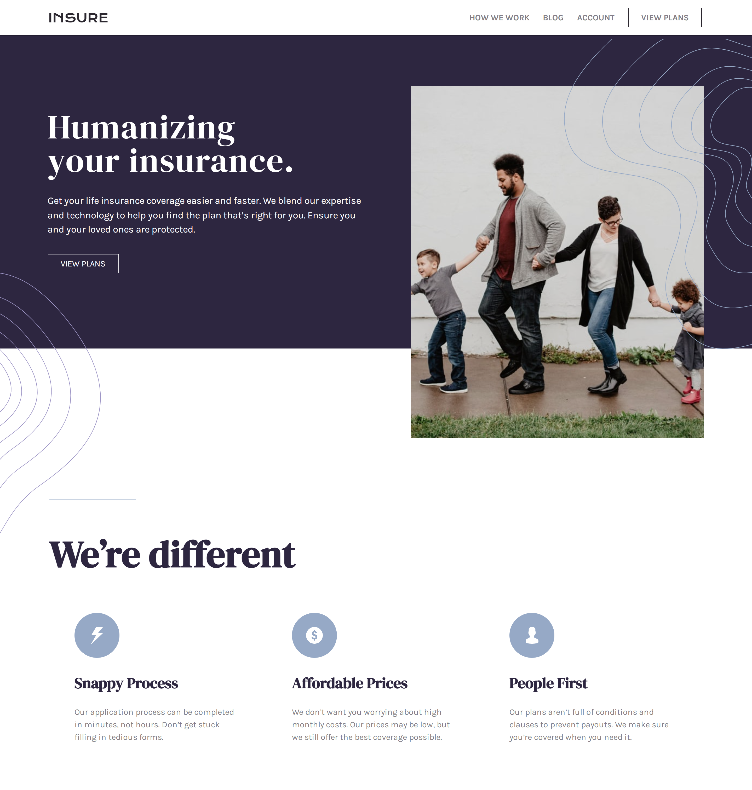

# Frontend Mentor - Insure landing page solution

This is a solution to the [Insure landing page challenge on Frontend Mentor](https://www.frontendmentor.io/challenges/insure-landing-page-uTU68JV8). Frontend Mentor challenges help you improve your coding skills by building realistic projects. 

## Table of contents

- [Overview](#overview)
  - [The challenge](#the-challenge)
  - [Screenshot](#screenshot)
  - [Links](#links)
- [My process](#my-process)
  - [Built with](#built-with)
  - [What I learned](#what-i-learned)
  - [Useful resources](#useful-resources)
- [Author](#author)


## Overview

### The challenge

Users should be able to:

- View the optimal layout for the site depending on their device's screen size
- See hover states for all interactive elements on the page

### Screenshot




### Links

- Solution URL: [CSS responsive landing page](https://www.frontendmentor.io/challenges/insure-landing-page-uTU68JV8/hub/css-responsive-landing-page-IKFsCYL5BU)
- Live Site URL: [Insure landing page](https://codernami.github.io/insure-landing-page/)

## My process

### Built with

- CSS 
- Flexbox
- Mobile-first workflow
- Javascript


### What I learned

- Copy the svg file at the end of the html before body ends. Then a simple way to use svg images is adding to html like this example. Use with # will reference to the svg file pasted at the end of the body.

```
  <svg width="112" height="18">
    <use href="#nav-logo"></use>
  </svg>  
```

- Use srcset to indicate the browser what image to load according to the screen width (600w, 1200w in this case). And always add a backup image.  

```

```


### Continued development

Working with svgs and how to apply according to the design and refine responsive development.


### Useful resources

- [A beginners guide to SVG](https://youtu.be/ZJSCl6XEdP8) - This helped me to add svg and styling them.

## Author

- Github - [Codernami](https://github.com/codernami)
- Frontend Mentor - [@codernami](https://www.frontendmentor.io/profile/codernami)
